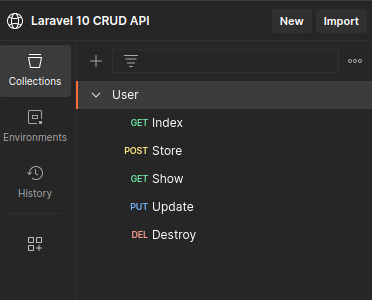

# Laravel 10 crud api 
<p align="center">
    
</p>
    
## About the project
CRUD User API made with Laravel 10.


# Releases
* You can create, read, update and delete users - CRUD;
* You can add a phone number to a user - One To One relationship;
* You can create posts indicating the user id you want to - One To Many relationship;
* You can create, read, update and delete user posts - CRUD;
* You can put a user bio;

<div align="center">

</div>

## Next updates

* FrontEnd Design;
* Documentation;
* Photo profile;
* Header profile;

## Getting Started

To get a local copy up and running follow these simple example steps.

### Prerequisites


* Php
* Laravel
* Postman (for endpoint testing)

### Step by step


1. Clone the repo
   ```sh
   git clone https://github.com/constpereiradev/laravel10-crud-api.git
   ```
2. Go to my Postman Workspace and use the endpoints
   ```sh
   https://www.postman.com/martian-firefly-354203/workspace/laravel-10-crud-api
   ```
3. Start Php artisan serve
   ```sh
   php artisan serve
   ```
4. Enjoy it!


# Contact me!
<p>Feel free to ask me anything and share your knowledge.</p>
📮 amandapereiradevcontact@gmail.com
